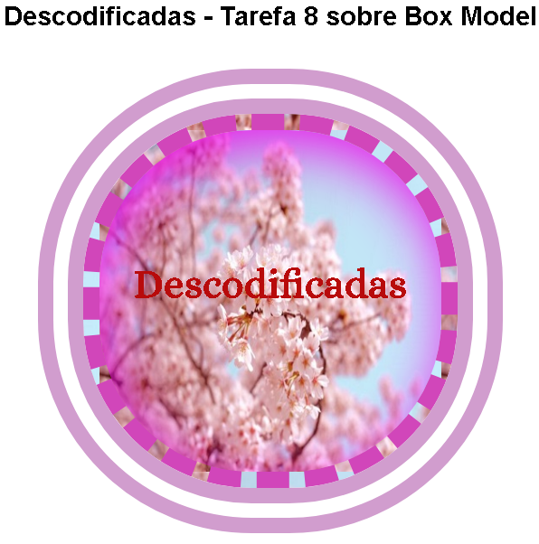

# Tarefa 8 do Descodificadas sobre Box model

>Tarefa 8 sobre Box model

Projeto contendo uma imagem com dimensões height: 400px e width: 400px com bordas e box-shadow.

[🔗 Clique aqui para acessar] (https://lineeiko.github.io/descodificadas_tarefa_8_box_model/)

>Descodificadas

O Descodificadas  é um programa que tem como objetivo de formar e apoiar mulheres que buscam entrar e já estão no setor de tecnologia por meio de uma metodologia que as ensinam a aprender independentemente através de conteúdos e práticas simples e descomplicadas buscando facilitar o processo de aprendizado.

O Programa tem a duração de 2 anos para a formação completa e é composto por 4 trilhas de aprendizagem, cada uma delas com duração de 6 meses.
As trilhas de aprendizagem são compostas por dois componentes que envolvem a formação específica na área desenvolvimento web – um de conteúdo e um de prática – e um componente de competências socioemocionais que visa o autodesenvolvimento.

## 🛠 Tecnologias

- HTML
- CSS
- Git e Github

